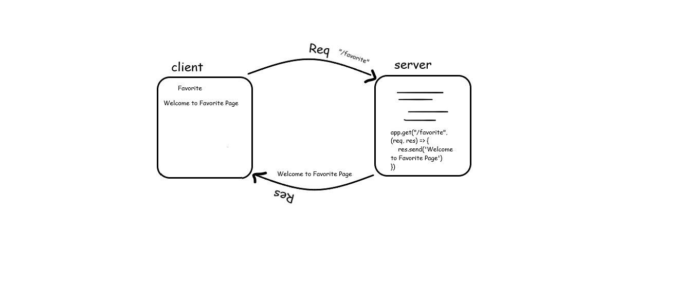

# Movies-Library
# Movies-Library - "1.0.0"

**Author Name**: Savana Hammod

## WRRC

## Overview
setting up the server of the movie app .

## Getting Started
<!-- What are the steps that a user must take in order to build this app on their own machine and get it running? -->
After cloning the repo in the local machine run this command npm i to install all the packages and node-modules

## Project Features
<!-- What are the features included in you app -->
To get Home page that contains data about the movie and to get favourit page . 
How to install all packages that needs to start building the server .
Get the idea abour wrrc and how the server deal with the reqests .
after this task i had a full imagination web request response cycle and i can make queries to get and insert in the data base